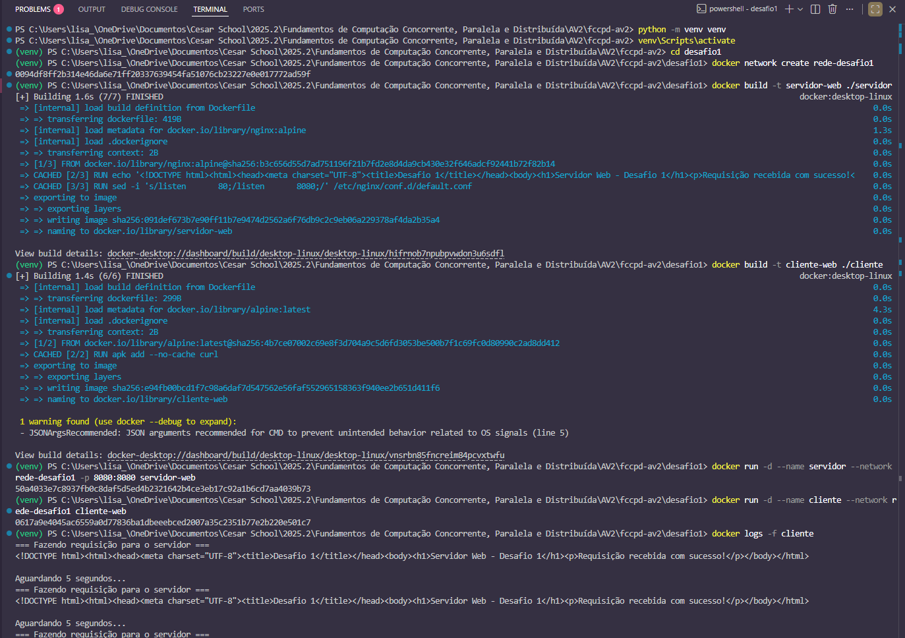

# Desafio 1 - Containers em Rede

## Descrição da Solução

Este projeto implementa dois containers Docker que se comunicam através de uma rede customizada:
- **Servidor**: Container com Nginx rodando na porta 8080
- **Cliente**: Container que faz requisições HTTP periódicas (a cada 5 segundos) para o servidor

## Arquitetura
```
┌─────────────────────────────────────┐
│      Rede: rede-desafio1            │
│                                     │
│  ┌──────────────┐  ┌─────────────┐  │
│  │   Servidor   │  │   Cliente   │  │
│  │  (Nginx)     │◄─┤  (curl)     │  │
│  │  Porta 8080  │  │  loop 5s    │  │
│  └──────────────┘  └─────────────┘  │
└─────────────────────────────────────┘
         │
         │ Porta exposta
         ▼
    Host: 8080
```

## Decisões Técnicas

1. **Nginx Alpine**: Escolhi a imagem Alpine por ser leve e de menor tamanho, mas suficiente para servir conteúdo estático no desafio
2. **Rede customizada**: Criei uma rede bridge (rede virtual do Docker) nomeada para permitir comunicação entre containers usando seus nomes ao invés de IPs
3. **Cliente com curl**: Usei Alpine (bastante leve) + curl (ferramenta para fazer requisições HTTP) para fazer requisições periódicas de forma simples e eficiente

## Como Funciona

### Servidor
- Baseado na imagem `nginx:alpine` (imagem pronta do Docker Hub que já tem o Nginx instalado; de forma leiga, seria como baixar um "computador virtual" que já vem com servidor web)
- Cria uma página HTML personalizada em `/usr/share/nginx/html/index.html`
  - `/usr/share/nginx/html/` é a pasta padrão onde o Nginx procura arquivos
  - `index.html` é o arquivo padrão que o Nginx serve quando alguém acessa
  - Em outras palavras, seria como criar um arquivo `.html` no meu computador
- Configura Nginx para escutar na porta 8080
  - Por padrão, Nginx escuta na porta 80, mas para esse desafio foi escolhida a 8080
  - Comando usado: `sed -i 's/listen 80;/listen 8080;/' /etc/nginx/conf.d/default.conf`
- Fica aguardando requisições HTTP
  - O Nginx roda continuamente
  - Quando alguém acessa `http://servidor:8080`, ele responde com o `index.html`

### Cliente
- Baseado na imagem `alpine:latest` (imagem pronta do Docker Hub; Alpine é uma distribuição Linux super pequena, ~5MB)
- Instala o pacote `curl`
  - Comando usado: `apk add --no-cache curl`
  - `apk` é o gerenciador de pacotes do Alpine (similar ao `apt` no Ubuntu)
  - `curl` é a ferramenta para fazer requisições HTTP (GET, POST, etc)
  - `--no-cache` não salva cache, mantendo a imagem menor
- Executa um loop infinito que faz requisições periódicas
  - A cada 5 segundos, faz uma requisição HTTP para `http://servidor:8080`
  - Exibe a resposta recebida do servidor
  - Aguarda 5 segundos antes de repetir o ciclo
  - O loop continua indefinidamente enquanto o container estiver rodando

**Fluxo de comunicação:**
```
┌─────────────────────────────────────┐
│  Container Cliente (loop infinito)  │
└─────────────────────────────────────┘
           │
           ├─→ 1. Imprime "Fazendo requisição"
           │
           ├─→ 2. curl http://servidor:8080
           │           │
           │           └─→ Envia requisição HTTP
           │                     ↓
           │           ┌──────────────────┐
           │           │   Servidor       │
           │           │   (Nginx)        │
           │           │   Porta 8080     │
           │           └──────────────────┘
           │                     │
           │      Resposta: <h1>Servidor Web...</h1>
           │                     ↓
           ├─→ 3. Exibe resposta na tela
           │
           ├─→ 4. Imprime "Aguardando 5 segundos"
           │
           ├─→ 5. sleep 5 (pausa de 5 segundos)
           │
           └─→ Volta ao passo 1 (loop infinito)
```

### Rede Docker
- Nome: `rede-desafio1`
  - Nome dado para identificar facilmente a rede
  - Usado para conectar os containers entre si
  - Comando usado: `docker network create rede-desafio1`
- Tipo: bridge (rede padrão do Docker)
  - Cria uma rede virtual isolada dentro do computador
  - Cada container recebe um IP automático (ex: 172.18.0.2, 172.18.0.3)
  - Containers na mesma bridge podem conversar entre si
  - Containers em bridges diferentes **não** se comunicam
  - Proporciona isolamento e segurança
- Permite comunicação usando nomes como hostname
  - Hostname é o "nome do computador" na rede
  - Docker possui um DNS interno que traduz: `nome do container → IP`
  - Exemplo: `curl http://servidor:8080` é traduzido para `curl http://172.18.0.2:8080`
  - É mais fácil e confiável usar nomes do que IPs (que podem mudar)

**Estrutura da rede:**
```
Seu Computador (Host)
├── Kernel Linux
├── Docker Engine
│   └── Rede Bridge "rede-desafio1" (rede virtual)
│       ├── Container Servidor (172.18.0.2)
│       └── Container Cliente (172.18.0.3)
```

## Instruções de Execução
### 1. Entrar na pasta desafio1
```bash
cd desafio1
```

### 2. Criar a rede Docker
```bash
docker network create rede-desafio1
```

### 3. Buildar as imagens
```bash
docker build -t servidor-web ./servidor
docker build -t cliente-web ./cliente
```

### 4. Executar o servidor
```bash
docker run -d --name servidor --network rede-desafio1 -p 8080:8080 servidor-web
```

### 5. Executar o cliente
```bash
docker run -d --name cliente --network rede-desafio1 cliente-web
```

### 6. Visualizar os logs (Teste de Comunicação)
```bash
docker logs -f cliente
```


### 7. Testar diretamente no navegador
Acesse: `http://localhost:8080`


## Parar e Limpar
```bash
# Parar os containers
docker stop servidor cliente

# Remover os containers
docker rm servidor cliente

# Remover a rede
docker network rm rede-desafio1

# Remover as imagens (opcional)
docker rmi servidor-web cliente-web
```
## Scripts de Execução

Este projeto inclui scripts de automação para facilitar a execução em diferentes sistemas operacionais.

```bash
cd desafio1
```

### Linux/Mac

**Executar:**
```bash
chmod +x run.sh
./run.sh
```

**Parar e limpar:**
```bash
chmod +x stop.sh
./stop.sh
```

### Windows PowerShell

**Executar:**
```powershell
.\run.ps1
```

**Parar e limpar:**
```powershell
.\stop.ps1
```

⚠️ **Nota:** Se aparecer erro de política de execução no Windows, execute antes:
```powershell
Set-ExecutionPolicy -ExecutionPolicy RemoteSigned -Scope CurrentUser
```

### Execução Manual (alternativa)

Se preferir executar manualmente sem os scripts, siga os passos na seção "Instruções de Execução" acima.

## Resultado Esperado

Ao executar `docker logs -f cliente`, você verá algo como:
```
=== Fazendo requisição para o servidor ===
<h1>Servidor Web - Desafio 1</h1><p>Requisição recebida com sucesso!</p>

Aguardando 5 segundos...
=== Fazendo requisição para o servidor ===
<h1>Servidor Web - Desafio 1</h1><p>Requisição recebida com sucesso!</p>

Aguardando 5 segundos...
```

## Estrutura do Projeto
```
desafio1/
├── servidor/
│   └── Dockerfile
├── cliente/
│   └── Dockerfile
├── run.sh          ← Copie o código 1
├── run.ps1         ← Copie o código 2
├── stop.sh         ← Copie o código 3
├── stop.ps1        ← Copie o código 4
└── README.md
```