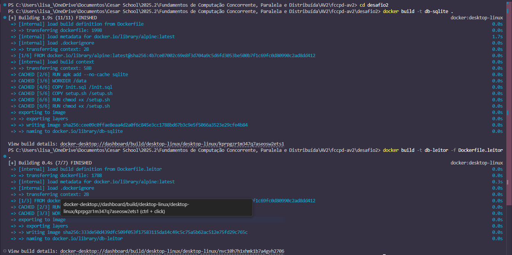
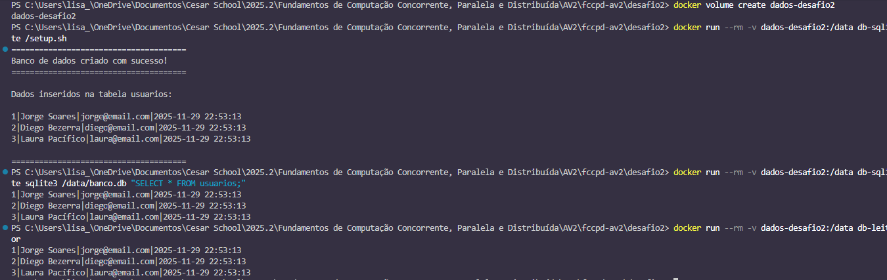
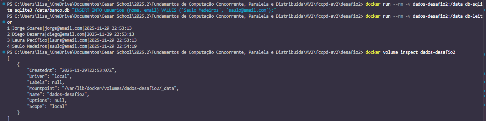
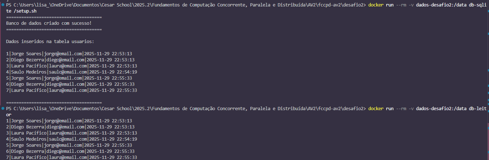
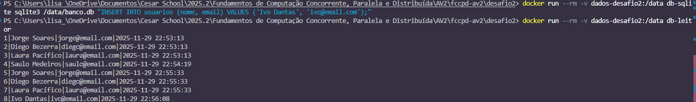
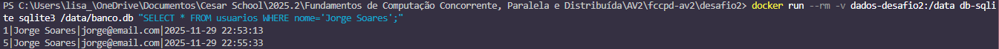

# Desafio 2 - Volumes e Persistência

## Descrição da Solução

Este projeto demonstra o uso de volumes Docker para persistência de dados. Um container SQLite cria e manipula um banco de dados, cujos dados permanecem armazenados mesmo após a remoção do container.

**Componentes:**
- **Container SQLite**: Cria e manipula o banco de dados
- **Container Leitor**: Segundo container que lê os dados persistidos (requisito opcional)
- **Volume Docker**: Armazena os dados de forma persistente
- **Scripts SQL**: Inicializam a estrutura e dados do banco

## Arquitetura
```
┌─────────────────────────────────────────────┐
│         Computador (Host)                   │
│                                             │
│  ┌────────────────────────────────────┐     │
│  │   Volume: dados-desafio2           │     │
│  │   (Armazenamento Persistente)      │     │ 
│  │   ├── banco.db                     │     │
│  │   └── tabela: usuarios             │     │
│  └────────────────────────────────────┘     │
│            ▲                   ▲            │
│            │                   │            │
│     ┌──────┴─────┐      ┌─────┴──────┐      │
│     │ Container  │      │ Container  │      │
│     │   (setup)  │      │  (leitor)  │      │
│     │  SQLite    │      │  SQLite    │      │
│     └────────────┘      └────────────┘      │
│      Cria dados          Lê dados           │
└─────────────────────────────────────────────┘
```

## Decisões Técnicas

1. **SQLite**: Escolhi SQLite por ser um banco de dados leve, sem necessidade de servidor separado, e armazenar tudo em um único arquivo, facilitando a demonstração de persistência
2. **Alpine Linux**: Usei Alpine como base por ser extremamente leve (~5MB) e suficiente para executar SQLite
3. **Volume nomeado**: Criei um volume nomeado (`dados-desafio2`) ao invés de bind mount, pois volumes são gerenciados automaticamente pelo Docker (o Docker escolhe onde armazenar e cuida das permissões de acesso), têm melhor performance e funcionam igualmente em qualquer sistema operacional
4. **Script de inicialização**: Separei a lógica SQL em arquivos distintos para manter o código organizado e reutilizável
   - `init.sql`: contém a lógica do banco (CREATE TABLE, INSERT)
   - `setup.sh`: executa o init.sql e exibe os resultados
5. **Container leitor**: Criei um segundo container dedicado apenas à leitura para demonstrar que múltiplos containers podem acessar o mesmo volume persistente

## Como Funciona

### Container SQLite
- Baseado na imagem `alpine:latest` (distribuição Linux leve em sua versão mais recente)
- Instala o pacote `sqlite` para manipulação do banco de dados
  - Comando usado: `apk add --no-cache sqlite`
  - `apk` = instalador de programas do Alpine
  - `add` = instalar
  - `sqlite` = o programa que queremos
- Define `/data` como diretório de trabalho (onde o banco será armazenado e montamos o volume Docker)
- Copia os scripts SQL e shell para dentro da imagem (pega arquivos do computador e coloca dentro do container)
  - `init.sql`: contém comandos para criar tabela e inserir dados
  - `setup.sh`: script que executa o init.sql e exibe os resultados
- Executa comandos SQL para criar, ler, atualizar ou deletar dados (o container pode fazer operações no banco de dados)

### Container Leitor (Opcional)
- Baseado na imagem `alpine:latest`
- Instala SQLite da mesma forma que o container principal
- Define `/data` como diretório de trabalho
- Executa automaticamente uma query de leitura ao iniciar
  - Comando padrão: `SELECT * FROM usuarios;`
- Demonstra que múltiplos containers podem acessar o mesmo volume

### Volume Docker
- Nome: `dados-desafio2`
  - Volume nomeado criado pelo Docker
  - Comando usado: `docker volume create dados-desafio2`
- Tipo: Volume gerenciado pelo Docker
  - Armazenado em: `/var/lib/docker/volumes/` (Linux/Mac) ou em local gerenciado pelo Docker Desktop (Windows)
  - Docker gerencia automaticamente o ciclo de vida do volume
  - Melhor performance que bind mounts
- Montado em: `/data` dentro do container
  - Quando o container acessa `/data/banco.db`, está lendo/escrevendo no volume
  - Múltiplos containers podem acessar o mesmo volume
- Persistência garantida
  - Dados permanecem mesmo após remover o container
  - Volume só é excluído com comando explícito (`docker volume rm`)

**Fluxo de persistência:**
```
1. Container é criado
2. Volume é montado em /data
3. Container cria banco.db em /data
        ↓
   Dados gravados no VOLUME
   (não no container)
        ↓
4. Container é removido
        ↓
   Dados PERMANECEM no volume
        ↓
5. Novo container é criado
6. Mesmo volume é montado em /data
7. Container acessa banco.db existente
        ↓
   Dados RECUPERADOS!
```

### Estrutura do Banco de Dados

**Tabela: usuarios**
```sql
CREATE TABLE usuarios (
    id INTEGER PRIMARY KEY AUTOINCREMENT,
    nome TEXT NOT NULL,
    email TEXT NOT NULL,
    data_criacao TIMESTAMP DEFAULT CURRENT_TIMESTAMP
);
```

**Dados iniciais:**
- Jorge Soares (jorge@email.com)
- Diego Bezerra (diego@email.com)
- Laura Pacífico (laura@email.com)

## Instruções de Execução

### 1. Entrar na pasta desafio2
```bash
cd desafio2
```

### 2. Buildar as imagens
```bash
docker build -t db-sqlite .
docker build -t db-leitor -f Dockerfile.leitor .
```


### 3. Criar o volume
```bash
docker volume create dados-desafio2
```

### 4. Executar o setup (criar banco e inserir dados)
```bash
docker run --rm -v dados-desafio2:/data db-sqlite /setup.sh
```

### 5. Verificar os dados com o container principal
```bash
docker run --rm -v dados-desafio2:/data db-sqlite sqlite3 /data/banco.db "SELECT * FROM usuarios;"
```

### 6. Verificar os dados com o container leitor
```bash
docker run --rm -v dados-desafio2:/data db-leitor
```


### 7. Inserir mais dados (demonstrar persistência)
```bash
docker run --rm -v dados-desafio2:/data db-sqlite sqlite3 /data/banco.db "INSERT INTO usuarios (nome, email) VALUES ('Saulo Medeiros', 'saulo@email.com');"
```

### 8. Verificar novamente (deve mostrar 4 usuários)
```bash
docker run --rm -v dados-desafio2:/data db-leitor
```

### 9. Inspecionar o volume
```bash
docker volume inspect dados-desafio2
```


## Demonstração de Persistência

### Teste 1: Dados persistem após remover container
⚠️ **Nota:** Se você executar este teste após seguir as "Instruções de Execução", os dados serão duplicados (como mostrado na imagem). Isso acontece porque o `setup.sh` será executado novamente, inserindo mais 3 usuários. Essa duplicação na verdade **demonstra a persistência** - os dados anteriores permanecem no volume mesmo após remover containers!

Para este teste, a duplicação não é um problema, pois o objetivo é apenas comprovar que os dados persistem.
```bash
# Cria dados.
# Container é automaticamente removido (--rm)
# Mas os dados permanecem no volume
docker run --rm -v dados-desafio2:/data db-sqlite /setup.sh

# Novo container lê os mesmos dados
docker run --rm -v dados-desafio2:/data db-leitor
```


### Teste 2: Múltiplos containers acessam o mesmo volume
```bash
# Container 1: insere dados
docker run --rm -v dados-desafio2:/data db-sqlite sqlite3 /data/banco.db "INSERT INTO usuarios (nome, email) VALUES ('Ivo Dantas', 'ivo@email.com');"

# Container 2 (leitor): lê os dados inseridos pelo Container 1
docker run --rm -v dados-desafio2:/data db-leitor
```


### Teste 3: Container leitor específico
```bash
# Usar o container leitor para buscar um usuário específico
docker run --rm -v dados-desafio2:/data db-sqlite sqlite3 /data/banco.db "SELECT * FROM usuarios WHERE nome='Jorge Soares';"
```


## Parar e Limpar
```bash
# Remover o volume
docker volume rm dados-desafio2

# Remover as imagens (opcional)
docker rmi db-sqlite db-leitor

# Listar todos os volumes
docker volume ls

# Remover volumes não utilizados
docker volume prune
```

## Resultado Esperado

### Ao executar o setup:
```
======================================
Banco de dados criado com sucesso!
======================================

Dados inseridos na tabela usuarios:

1|Jorge Soares|jorge@email.com|2025-11-29 22:53:13
2|Diego Bezerra|diego@email.com|2025-11-29 22:53:13
3|Laura Pacífico|laura@email.com|2025-11-29 22:53:13

======================================
```

### Ao consultar os dados:
```
1|Jorge Soares|jorge@email.com|2025-11-29 22:53:13
2|Diego Bezerra|diego@email.com|2025-11-29 22:53:13
3|Laura Pacífico|laura@email.com|2025-11-29 22:53:13
```

### Ao usar o container leitor:
```
1|Jorge Soares|jorge@email.com|2025-11-29 22:53:13
2|Diego Bezerra|diego@email.com|2025-11-29 22:53:13
3|Laura Pacífico|laura@email.com|2025-11-29 22:53:13
```

### Ao inspecionar o volume:
```json
[
    {
        "CreatedAt": "2025-11-29T22:53:07Z",
        "Driver": "local",
        "Labels": null,
        "Mountpoint": "/var/lib/docker/volumes/dados-desafio2/_data",
        "Name": "dados-desafio2",
        "Options": null,
        "Scope": "local"
    }
]
```

## Estrutura do Projeto
```
desafio2/
├── Dockerfile
├── Dockerfile.leitor
├── init.sql
├── setup.sh
└── README.md
```