# Desafio 3 - Docker Compose Orquestrando Serviços

## Descrição da Solução

Este projeto demonstra o uso de Docker Compose para orquestrar múltiplos serviços dependentes. A aplicação implementa um sistema de contador de visitas que utiliza três serviços integrados: uma API web, um banco de dados relacional e um sistema de cache.

**Componentes:**
- **Web (Flask)**: API REST que gerencia o contador de visitas
- **DB (PostgreSQL)**: Banco de dados que armazena os contadores de forma persistente
- **Cache (Redis)**: Sistema de cache para melhorar a performance das consultas

## Arquitetura
```
┌─────────────────────────────────────────────────┐
│         Docker Compose (app-network)            │
│                                                 │
│  ┌──────────────┐     ┌──────────────┐         │
│  │     Web      │────▶│   Cache      │         │
│  │   (Flask)    │     │   (Redis)    │         │
│  │  Porta 5000  │     │              │         │
│  └──────┬───────┘     └──────────────┘         │
│         │                                       │
│         │                                       │
│         ▼                                       │
│  ┌──────────────┐                               │
│  │      DB      │                               │
│  │ (PostgreSQL) │                               │
│  │              │                               │
│  └──────────────┘                               │
│                                                 │
└─────────────────────────────────────────────────┘
         │
         │ Porta exposta
         ▼
    Host: 5000
```

## Decisões Técnicas

1. **Flask (Python)**: Escolhi Flask por ser um framework web leve e simples, ideal para criar APIs REST rapidamente
2. **PostgreSQL**: Usei PostgreSQL como banco de dados relacional por ser robusto, confiável e suportar operações ACID (garantia de consistência dos dados)
3. **Redis**: Implementei Redis como camada de cache para reduzir a carga no banco de dados e melhorar o tempo de resposta das consultas (cache de 30 segundos)
4. **depends_on**: Configurei dependências para garantir que o serviço web só inicie após o banco de dados e o cache estarem disponíveis
5. **Rede interna (bridge)**: Criei uma rede customizada para que os serviços se comuniquem usando seus nomes ao invés de IPs
6. **Variáveis de ambiente**: Centralizei as configurações (credenciais, hosts) em variáveis de ambiente no docker-compose.yml para facilitar manutenção e segurança

## Como Funciona

### Serviço Web (Flask)
- Baseado na imagem `python:3.9-slim` (versão leve do Python)
- Instala dependências: Flask, psycopg2-binary (driver PostgreSQL) e redis
- Expõe a porta 5000 para acesso externo
- Conecta-se ao PostgreSQL usando variáveis de ambiente
- Conecta-se ao Redis para operações de cache
- Implementa três endpoints:
  - `GET /` - Informações sobre a API
  - `GET /visitas` - Retorna o número de visitas (tenta cache primeiro, depois banco)
  - `POST /incrementar` - Incrementa o contador e invalida o cache

### Serviço DB (PostgreSQL)
- Baseado na imagem `postgres:15-alpine`
- Cria automaticamente o banco `contador_db`
- Usa volume nomeado para persistir dados
- Acessível apenas internamente na rede Docker
- Armazena a tabela `visitas` com o contador

### Serviço Cache (Redis)
- Baseado na imagem `redis:7-alpine`
- Funciona como cache em memória
- Cache com expiração de 30 segundos
- Reduz carga no banco de dados
- Invalidado automaticamente ao incrementar

### Rede e Dependências
- **Rede bridge customizada** (`app-network`):
  - Permite comunicação entre serviços usando nomes
  - Isolamento de outros containers
  - DNS interno do Docker traduz nomes para IPs
- **depends_on**:
  - Web depende de DB e Cache
  - Garante ordem de inicialização
  - Web só inicia após DB e Cache estarem prontos

**Fluxo de requisição:**
```
1. Cliente faz GET /visitas
        ↓
2. Web verifica cache (Redis)
        ↓
3a. Se está no cache → retorna {"source": "cache", "visitas": N}
        ↓
3b. Se NÃO está no cache:
        ↓
    4. Web consulta PostgreSQL
        ↓
    5. Salva no cache (30s)
        ↓
    6. Retorna {"source": "database", "visitas": N}
```

## Instruções de Execução

### 1. Entrar na pasta desafio3
```bash
cd desafio3
```

### 2. Subir todos os serviços
```bash
docker-compose up -d
```

### 3. Verificar se os serviços estão rodando
```bash
docker-compose ps
```

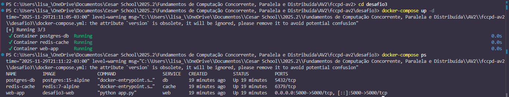

### 4. Ver logs da aplicação web
```bash
docker-compose logs -f web
```

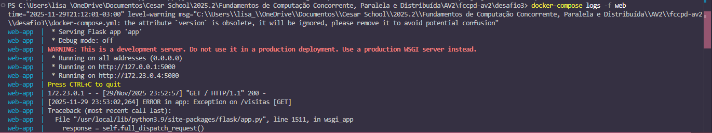

### 5. Testar a API

**Ver endpoints disponíveis:**
```powershell
curl http://localhost:5000
```

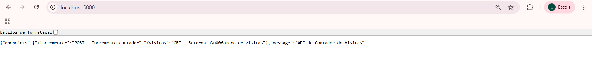
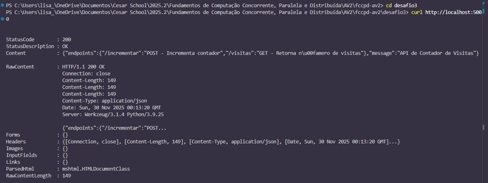

**Incrementar contador:**
```powershell
# Realiza uma requisição POST para adicionar uma nova visita
Invoke-WebRequest -Uri http://localhost:5000/incrementar -Method POST
```

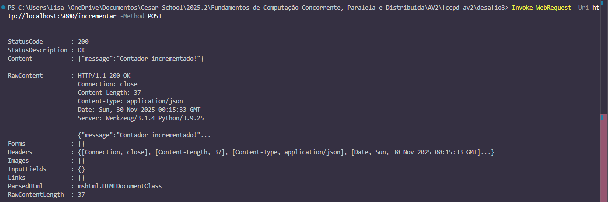

**Ver número de visitas:**

⚠️ **Nota:** Nos testes anteriores o contador já estava em 3, portanto este comando levará o total para 4

```powershell
curl http://localhost:5000/visitas
```

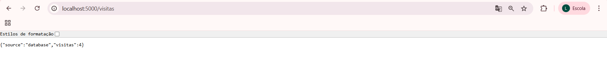
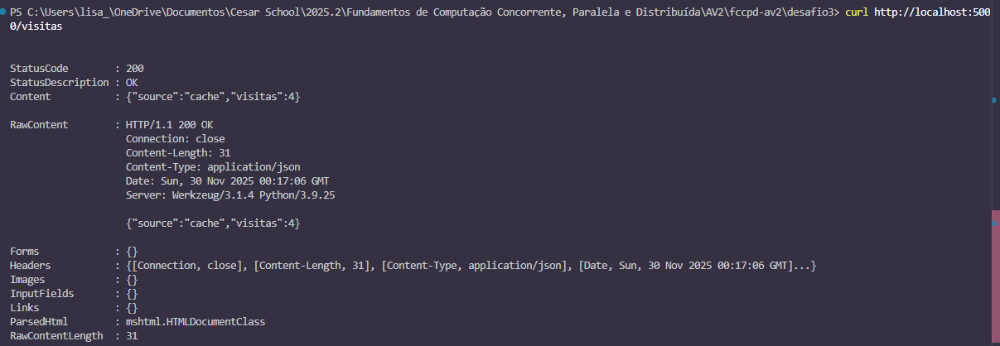

**Incrementar mais vezes:**
```powershell
Invoke-WebRequest -Uri http://localhost:5000/incrementar -Method POST
Invoke-WebRequest -Uri http://localhost:5000/incrementar -Method POST

# Ver contador atualizado
curl http://localhost:5000/visitas
```

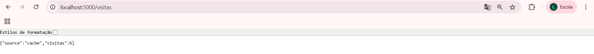
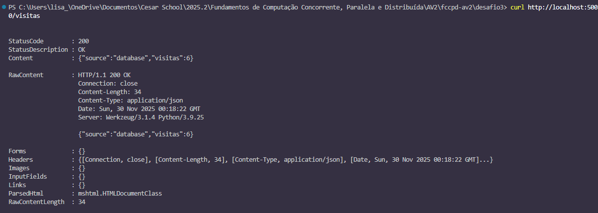

### 6. Testar persistência do banco de dados
```bash
# Parar os serviços
docker-compose down

# Subir novamente
docker-compose up -d
```

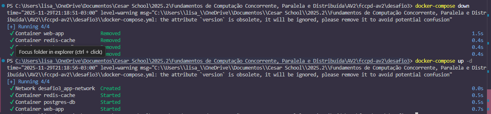

```bash
# Verificar que os dados persistiram
curl http://localhost:5000/visitas
```

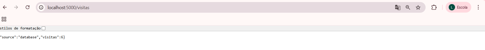
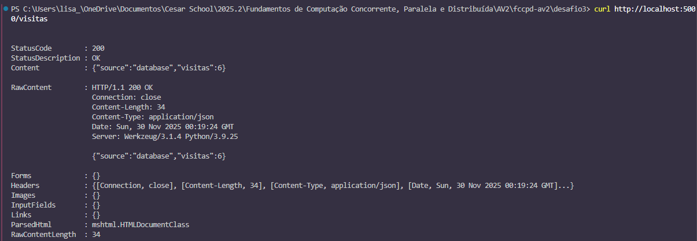

### 7. Verificar comunicação entre serviços
A comunicação foi validada através dos endpoints da API. O retorno dos dados comprova que o serviço web consegue conectar tanto no banco PostgreSQL (porta 5432) quanto no Redis (porta 6379) através da rede interna app-network.

## Demonstração de Funcionalidades

### Teste 1: Cache funcionando

**Primeira consulta (busca do banco):**
```bash
curl http://localhost:5000/visitas
# Resposta: {"source": "database", "visitas": 6}
```


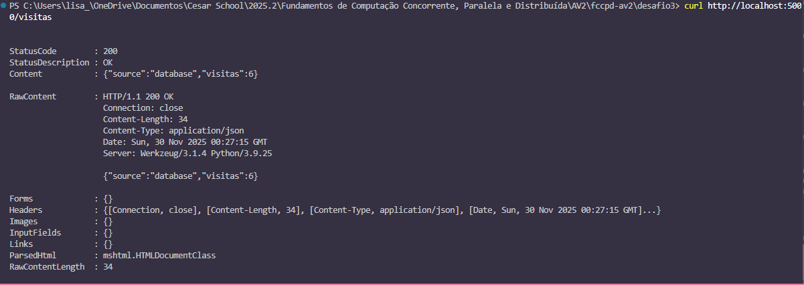

**Segunda consulta imediata (busca do cache):**
```bash
curl http://localhost:5000/visitas
# Resposta: {"source": "cache", "visitas": 6}
```

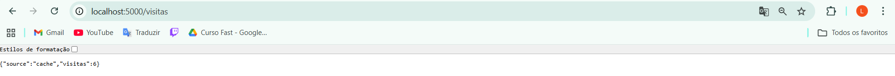
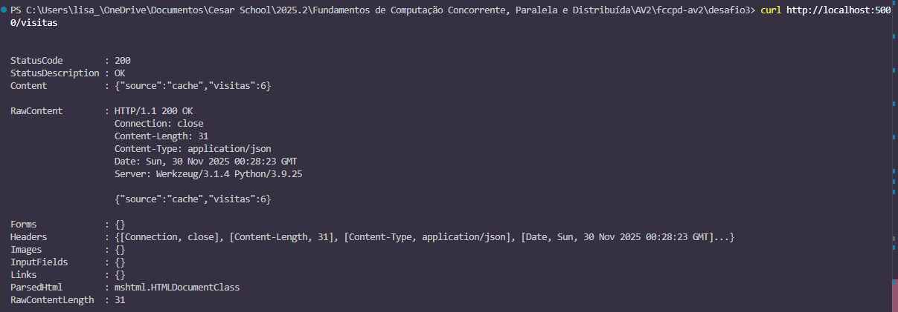

### Teste 2: Invalidação de cache

**Incrementar (invalida cache):**
```bash
Invoke-WebRequest -Uri http://localhost:5000/incrementar -Method POST
```

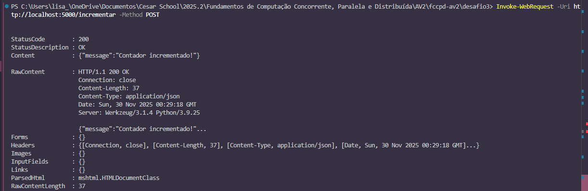

**Consultar (busca do banco novamente):**
```bash
curl http://localhost:5000/visitas
# Resposta: {"source": "database", "visitas": 7}
```

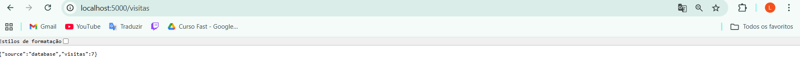
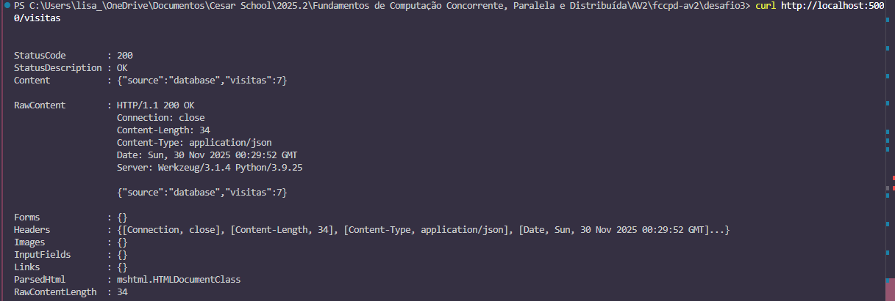

### Teste 3: Persistência de dados
```bash
# Ver contador atual
curl http://localhost:5000/visitas

# Parar tudo
docker-compose down

# Subir novamente
docker-compose up -d

# Dados ainda estão lá
curl http://localhost:5000/visitas
```

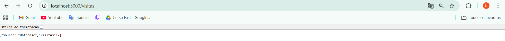
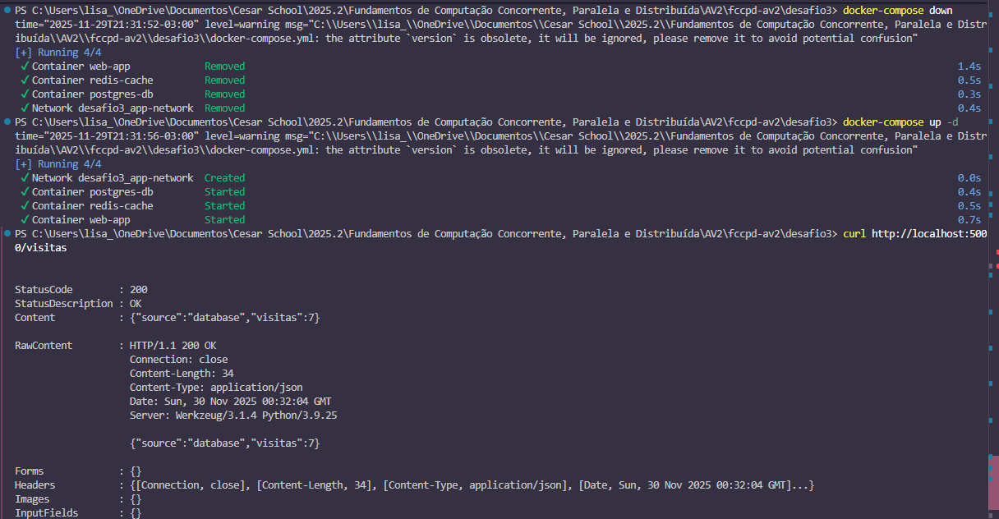

## Parar e Limpar
```bash
# Parar os serviços (mantém volumes)
docker-compose down

# Parar e remover volumes (apaga dados)
docker-compose down -v

# Ver logs de um serviço específico
docker-compose logs web
docker-compose logs db
docker-compose logs cache

# Reconstruir imagens
docker-compose build

# Subir e reconstruir
docker-compose up -d --build
```

## Resultado Esperado

### Ao acessar `GET /`:
```json
{
  "message": "API de Contador de Visitas",
  "endpoints": {
    "/incrementar": "POST - Incrementa contador",
    "/visitas": "GET - Retorna número de visitas"
  }
}
```

### Ao incrementar `POST /incrementar`:
```json
{"message": "Contador incrementado!"}
```

### Ao consultar `GET /visitas` (primeira vez):
```json
{"source": "database", "visitas": 1}
```

### Ao consultar `GET /visitas` (com cache):
```json
{"source": "cache", "visitas": 1}
```

### Ao verificar serviços rodando:
```
NAME            IMAGE               STATUS
web-app         desafio3-web        Up
postgres-db     postgres:15-alpine  Up
redis-cache     redis:7-alpine      Up
```

## Estrutura do Projeto
```
desafio3/
├── web/
│   ├── Dockerfile
│   └── app.py
├── docker-compose.yml
└── README.md
```

## Endpoints da API

| Método | Endpoint | Descrição | Resposta |
|--------|----------|-----------|----------|
| GET | `/` | Informações da API | JSON com endpoints |
| GET | `/visitas` | Retorna contador | JSON com número e fonte (cache/db) |
| POST | `/incrementar` | Incrementa contador | JSON com mensagem de sucesso |

## Variáveis de Ambiente

**Serviço Web:**
- `DB_HOST`: Host do PostgreSQL (padrão: `db`)
- `DB_NAME`: Nome do banco (padrão: `contador_db`)
- `DB_USER`: Usuário do banco (padrão: `postgres`)
- `DB_PASS`: Senha do banco (padrão: `senha123`)
- `REDIS_HOST`: Host do Redis (padrão: `cache`)

**Serviço DB:**
- `POSTGRES_DB`: Nome do banco
- `POSTGRES_USER`: Usuário
- `POSTGRES_PASSWORD`: Senha

## Troubleshooting

**Problema:** Erro "relation visitas does not exist"
- **Solução:** Execute `POST /incrementar` primeiro para criar a tabela

**Problema:** Serviços não se comunicam
- **Solução:** Verifique se todos estão na mesma rede com `docker network inspect desafio3_app-network`

**Problema:** Dados não persistem
- **Solução:** Verifique se o volume foi criado com `docker volume ls`