# Desafio 4 - Microsserviços Independentes

## Descrição da Solução

Este projeto implementa uma arquitetura de microsserviços simples composta por dois serviços independentes que se comunicam via protocolo HTTP REST. A aplicação demonstra o desacoplamento e a comunicação inter-container sem o uso de um banco de dados compartilhado.

**Componentes:**
- **Service A (Users)**: Microsserviço produtor que retorna dados de usuários em formato JSON
- **Service B (Consumer)**: Microsserviço consumidor que processa e formata os dados recebidos do Service A

## Arquitetura
```
┌─────────────────────────────────────────────────┐
│      Rede: microservices-net (Bridge)           │
│                                                 │
│  ┌──────────────┐           ┌──────────────┐   │
│  │  Service A   │◄─ HTTP ───│  Service B   │   │
│  │  (Produtor)  │   GET     │ (Consumidor) │   │
│  │  Porta 5000  │   JSON    │  Porta 5001  │   │
│  └──────────────┘           └──────────────┘   │
│                                                 │
└─────────────────────────────────────────────────┘
         │                             │
         │ Porta exposta               │ Porta exposta
         ▼                             ▼
    Host: 5000                    Host: 5001
  (Dados Brutos)                 (Relatório)
```

## Decisões Técnicas

1. **Flask (Python)**: Escolhi Flask por ser um framework web leve e simples, ideal para criar APIs REST rapidamente e por manter consistência com o Desafio 3
2. **Isolamento de Responsabilidades**: O Service A não sabe quem o consome; ele apenas fornece dados brutos (JSON). O Service B contém a lógica de negócio de apresentação, desacoplando a formatação dos dados da sua origem
3. **Biblioteca Requests**: Implementei no Service B para realizar chamadas HTTP síncronas ao Service A, permitindo a comunicação entre microsserviços
4. **Variáveis de Ambiente**: A URL do Service A é injetada no Service B (`SERVICE_A_URL`), permitindo que a configuração mude sem alterar o código (ex: mudança de ambiente Dev/Prod)
5. **Dockerfiles Individuais**: Cada serviço possui seu próprio contexto e dependências, garantindo total independência de build
6. **Rede customizada**: Criei uma rede bridge para permitir comunicação entre microsserviços usando seus nomes ao invés de IPs

## Como Funciona

### Service A (Produtor)
- Baseado na imagem `python:3.9-slim` (versão leve do Python)
- Instala dependência: Flask
- Expõe a porta 5000 para acesso externo
- Mantém dados simulados (mock) de usuários em memória
- Implementa dois endpoints:
  - `GET /` - Informações sobre o serviço
  - `GET /users` - Retorna lista de usuários em JSON

### Service B (Consumidor)
- Baseado na imagem `python:3.9-slim` (versão leve do Python)
- Instala dependências: Flask e requests
- Expõe a porta 5001 para acesso externo
- Conecta-se ao Service A usando variável de ambiente
- Implementa dois endpoints:
  - `GET /` - Informações sobre o serviço
  - `GET /users-report` - Consome Service A e retorna relatório formatado

### Rede Docker
- **Rede bridge customizada** (`microservices-net`):
  - Permite comunicação entre microsserviços usando nomes
  - Isolamento de outros containers
  - DNS interno do Docker traduz nomes para IPs
- **depends_on**:
  - Service B depende do Service A
  - Garante ordem de inicialização
  - Service B só inicia após Service A estar pronto

**Fluxo de comunicação:**
```
1. Cliente faz GET /users-report no Service B
        ↓
2. Service B identifica que precisa de dados
        ↓
3. Service B faz requisição HTTP GET para Service A
   URL: http://service-a:5000/users
        ↓
4. Service A responde com JSON de usuários
        ↓
5. Service B processa os dados (formata strings)
        ↓
6. Service B retorna relatório formatado ao cliente
   Resposta: {"source": "Service A", "total_users": 3, "report": [...]}
```

## Instruções de Execução

### 1. Entrar na pasta desafio4
```bash
cd desafio4
```

### 2. Subir todos os serviços
```bash
docker-compose up -d --build
```
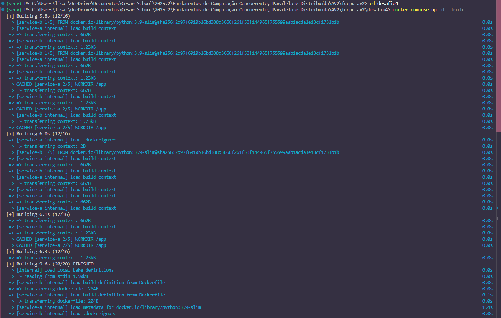

### 3. Verificar se os serviços estão rodando
```bash
docker-compose ps
```

### 4. Ver logs dos serviços
```bash
# Logs do Service A
docker-compose logs -f service-a
```
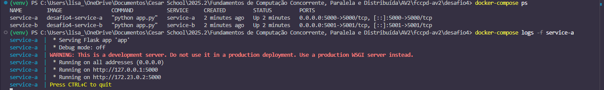
```bash
# Logs do Service B (Segundo terminal. Dar cd desafio4 de novo)
docker-compose logs -f service-b
```
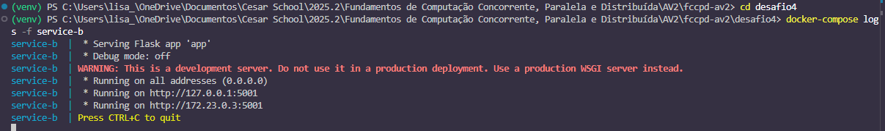

### 5. Testar os Microsserviços

⚠️ **Nota sobre encoding:** No Windows PowerShell, caracteres acentuados aparecem como Unicode (`\u00e1` = á, `\u00f3` = ó). Isso é normal e não afeta o funcionamento.

**Teste 1: Acessar Service A diretamente (Dados Brutos)**

Verificamos se o produtor está listando os usuários corretamente na porta 5000.
```powershell
# Terceiro terminal
curl http://localhost:5000/users
```
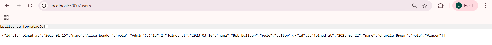
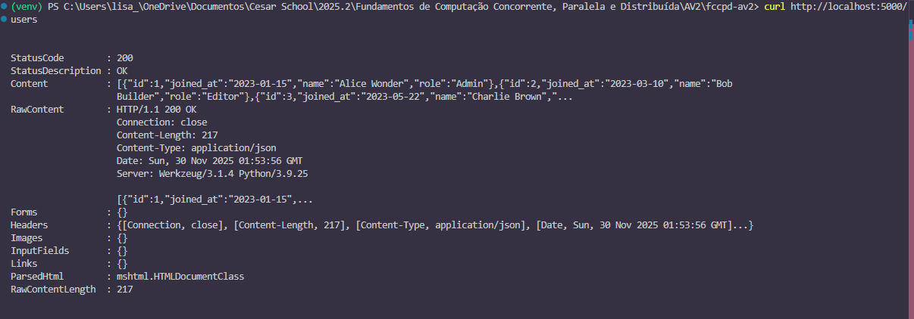

**Saída no Linux:**
```json
[
  {"id": 1, "name": "Alice Wonder", "joined_at": "2023-01-15", "role": "Admin"},
  {"id": 2, "name": "Bob Builder", "joined_at": "2023-03-10", "role": "Editor"},
  {"id": 3, "name": "Charlie Brown", "joined_at": "2023-05-22", "role": "Viewer"}
]
```

**Saída no Windows PowerShell:**
```
StatusCode        : 200
StatusDescription : OK
Content           : [{"id":1,"joined_at":"2023-01-15","name":"Alice Wonder","role":"Admin"},
                    {"id":2,"joined_at":"2023-03-10","name":"Bob Builder","role":"Editor"},
                    {"id":3,"joined_at":"2023-05-22","name":"Charlie Brown","role":"Viewer"}]
```

---

**Teste 2: Verificar informações do Service A**
```powershell
curl http://localhost:5000/
```

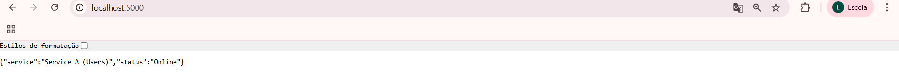
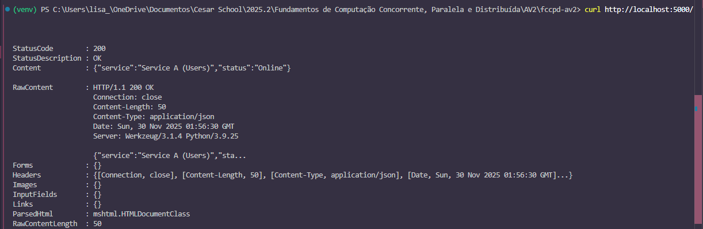

**Saída no Linux:**
```json
{"service": "Service A (Users)", "status": "Online"}
```

**Saída no Windows PowerShell:**
```
StatusCode        : 200
Content           : {"service":"Service A (Users)","status":"Online"}
```

---

**Teste 3: Acessar Service B (Relatório Processado)**

Solicitamos o relatório na porta 5001. Aqui ocorre a comunicação interna entre os containers.
```powershell
curl http://localhost:5001/users-report
```
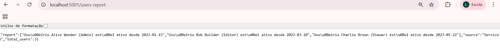
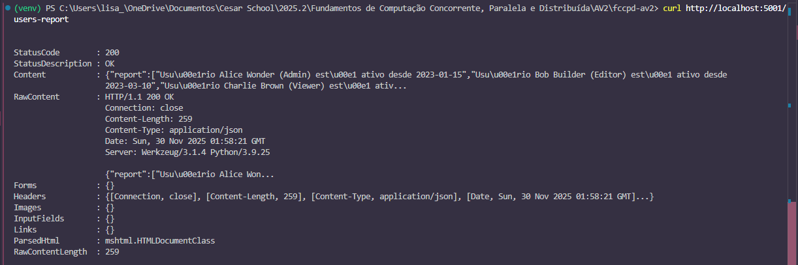

**Saída no Linux:**
```json
{
  "source": "Service A",
  "total_users": 3,
  "report": [
    "Usuário Alice Wonder (Admin) está ativo desde 2023-01-15",
    "Usuário Bob Builder (Editor) está ativo desde 2023-03-10",
    "Usuário Charlie Brown (Viewer) está ativo desde 2023-05-22"
  ]
}
```

**Saída no Windows PowerShell:**
```
StatusCode        : 200
Content           : {"report":["Usu\u00e1rio Alice Wonder (Admin) est\u00e1 ativo desde 2023-01-15",
                    "Usu\u00e1rio Bob Builder (Editor) est\u00e1 ativo desde 2023-03-10",
                    "Usu\u00e1rio Charlie Brown (Viewer) est\u00e1 ativo desde 2023-05-22"],
                    "source":"Service A","total_users":3}
```

💡 **Nota:** `\u00e1` = á, `\u00f3` = ó (encoding Unicode no PowerShell)

---

**Teste 4: Verificar informações do Service B**
```powershell
curl http://localhost:5001/
```
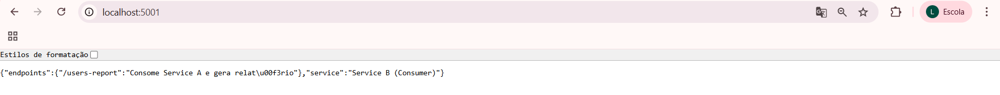
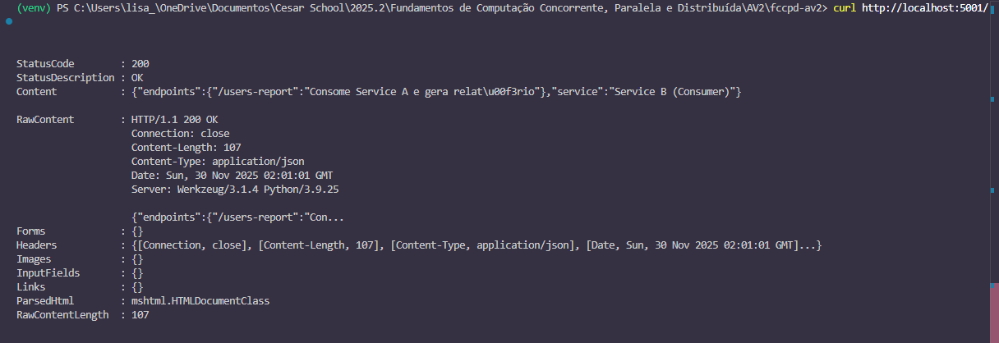

**Saída no Linux:**
```json
{
  "service": "Service B (Consumer)",
  "endpoints": {
    "/users-report": "Consome Service A e gera relatório"
  }
}
```

**Saída no Windows PowerShell:**
```
StatusCode        : 200
Content           : {"endpoints":{"/users-report":"Consome Service A e gera relat\u00f3rio"},
                    "service":"Service B (Consumer)"}
```

### 6. Por que isso comprova a comunicação entre microsserviços?

Os testes anteriores (passo 5) validam que os dois microsserviços estão se comunicando corretamente através da rede `microservices-net`. Aqui está a prova da comunicação:

**Comunicação Service B → Service A (comprovada):**
- ✅ O comando `GET /users-report` retornou `StatusCode: 200` → Service B conseguiu fazer requisição HTTP para Service A
- ✅ A resposta contém `"source": "Service A"` → Service B identificou a origem dos dados
- ✅ Os dados foram processados e formatados → Service B consumiu e transformou o JSON bruto
- ✅ O campo `"total_users": 3` está correto → Service B processou toda a lista recebida

**Comunicação através da rede Docker (comprovada):**
- ✅ O Service B usa `SERVICE_A_URL=http://service-a:5000` (nome, não IP)
- ✅ O DNS interno do Docker resolve `service-a` para o IP correto na rede `microservices-net`
- ✅ Ambos os containers estão isolados na mesma rede bridge customizada

**Evidências técnicas:**
- O Service B **NÃO** usa IP fixo como `172.19.0.2`
- Usa **nome do serviço** definido no docker-compose.yml: `service-a`
- O Docker Compose cria automaticamente a resolução DNS interna
- Se a rede não funcionasse, o Service B retornaria erro 503 com mensagem "Falha ao comunicar com Service A"

## Demonstração de Funcionalidades

### Teste 1: Dados brutos vs Dados processados

**Dados brutos do Service A:**
```bash
curl http://localhost:5000/users
```
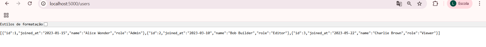
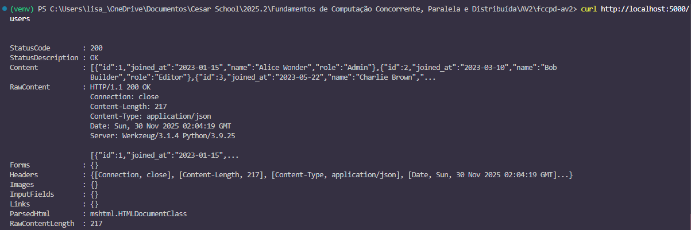

**Saída no Linux:**
```json
[
  {"id": 1, "name": "Alice Wonder", "joined_at": "2023-01-15", "role": "Admin"},
  {"id": 2, "name": "Bob Builder", "joined_at": "2023-03-10", "role": "Editor"},
  {"id": 3, "name": "Charlie Brown", "joined_at": "2023-05-22", "role": "Viewer"}
]
```

**Saída no Windows PowerShell:**
```
StatusCode        : 200
StatusDescription : OK
Content           : [{"id":1,"joined_at":"2023-01-15","name":"Alice Wonder","role":"Admin"},
                    {"id":2,"joined_at":"2023-03-10","name":"Bob Builder","role":"Editor"},
                    {"id":3,"joined_at":"2023-05-22","name":"Charlie Brown","role":"Viewer"}]
```

---

**Dados processados do Service B:**
```bash
curl http://localhost:5001/users-report
```
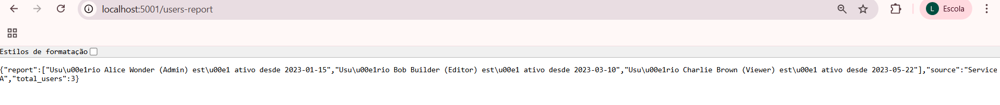
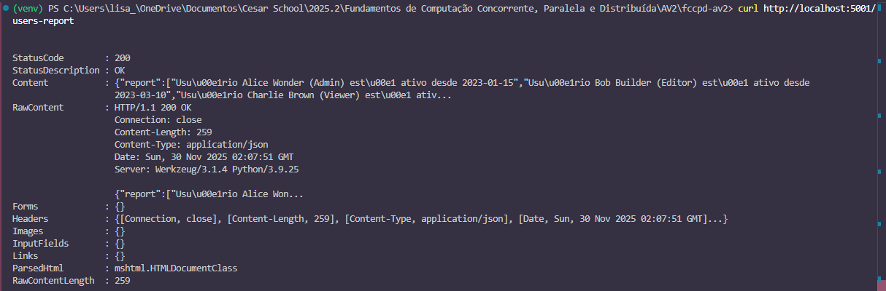

**Saída no Linux:**
```json
{
  "source": "Service A",
  "total_users": 3,
  "report": [
    "Usuário Alice Wonder (Admin) está ativo desde 2023-01-15",
    "Usuário Bob Builder (Editor) está ativo desde 2023-03-10",
    "Usuário Charlie Brown (Viewer) está ativo desde 2023-05-22"
  ]
}
```

**Saída no Windows PowerShell:**
```
StatusCode        : 200
StatusDescription : OK
Content           : {"report":["Usu\u00e1rio Alice Wonder (Admin) est\u00e1 ativo desde 2023-01-15",
                    "Usu\u00e1rio Bob Builder (Editor) est\u00e1 ativo desde 2023-03-10",
                    "Usu\u00e1rio Charlie Brown (Viewer) est\u00e1 ativo desde 2023-05-22"],
                    "source":"Service A","total_users":3}
```

💡 **Nota:** No Windows, `\u00e1` = á, `\u00f3` = ó (encoding Unicode no PowerShell)

### Teste 2: Tratamento de erros (Simular falha na comunicação)
```bash
# Parar o Service A
docker stop service-a

# Tentar acessar o relatório
curl http://localhost:5001/users-report
```
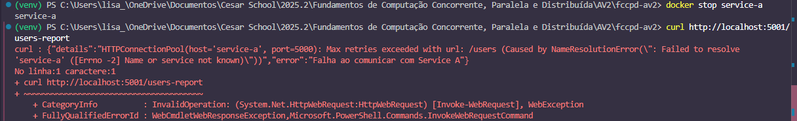

**Saída esperada no Linux:**
```json
{
  "error": "Falha ao comunicar com Service A",
  "details": "HTTPConnectionPool(host='service-a', port=5000): Max retries exceeded..."
}
```

**Saída no Windows PowerShell:**
```
curl : {"details":"HTTPConnectionPool(host='service-a', port=5000): Max retries exceeded with url: /users 
(Caused by NameResolutionError(\": Failed to resolve 'service-a' ([Errno -2] Name or service not known)\"))",
"error":"Falha ao comunicar com Service A"}
```

**Restartar o Service A:**
```bash
docker start service-a

# Aguardar alguns segundos e testar novamente
curl http://localhost:5001/users-report
```

Agora deve funcionar novamente!

## Parar e Limpar
```bash
# Parar os serviços
docker-compose down

# Parar e remover rede
docker-compose down --remove-orphans

# Ver logs de um serviço específico
docker-compose logs service-a
docker-compose logs service-b

# Reconstruir imagens
docker-compose build

# Subir e reconstruir
docker-compose up -d --build
```

## Scripts de Execução

Este projeto inclui scripts de automação para facilitar a execução em diferentes sistemas operacionais.

```bash
cd desafio4
```

### Linux/Mac

**Executar:**
```bash
chmod +x run.sh
./run.sh
```

**Parar e limpar:**
```bash
chmod +x stop.sh
./stop.sh
```

### Windows PowerShell

**Executar:**
```powershell
.\run.ps1
```

**Parar e limpar:**
```powershell
.\stop.ps1
```

⚠️ **Nota:** Se aparecer erro de política de execução no Windows, execute antes:
```powershell
Set-ExecutionPolicy -ExecutionPolicy RemoteSigned -Scope CurrentUser
```

### Execução Manual (alternativa)

Se preferir executar manualmente sem os scripts, siga os passos na seção "Instruções de Execução" abaixo.

## Resultado Esperado

### Ao acessar Service A `GET /`:

**Linux:**
```json
{"service": "Service A (Users)", "status": "Online"}
```

**Windows:**
```
StatusCode: 200
Content: {"service":"Service A (Users)","status":"Online"}
```

---

### Ao acessar Service A `GET /users`:

**Linux:**
```json
[
  {"id": 1, "joined_at": "2023-01-15", "name": "Alice Wonder", "role": "Admin"},
  {"id": 2, "joined_at": "2023-03-10", "name": "Bob Builder", "role": "Editor"},
  {"id": 3, "joined_at": "2023-05-22", "name": "Charlie Brown", "role": "Viewer"}
]
```

**Windows:**
```
StatusCode: 200
Content: [{"id":1,"joined_at":"2023-01-15","name":"Alice Wonder","role":"Admin"}...]
```

---

### Ao acessar Service B `GET /`:

**Linux:**
```json
{
  "service": "Service B (Consumer)",
  "endpoints": {"/users-report": "Consome Service A e gera relatório"}
}
```

**Windows:**
```
StatusCode: 200
Content: {"endpoints":{"/users-report":"Consome Service A e gera relat\u00f3rio"},...}
```

---

### Ao acessar Service B `GET /users-report`:

**Linux:**
```json
{
  "source": "Service A",
  "total_users": 3,
  "report": [
    "Usuário Alice Wonder (Admin) está ativo desde 2023-01-15",
    "Usuário Bob Builder (Editor) está ativo desde 2023-03-10",
    "Usuário Charlie Brown (Viewer) está ativo desde 2023-05-22"
  ]
}
```

**Windows:**
```
StatusCode: 200
Content: {"report":["Usu\u00e1rio Alice Wonder (Admin) est\u00e1 ativo desde 2023-01-15",...],
         "source":"Service A","total_users":3}
```

💡 **Lembre-se:** No Windows, `\u00e1` = á, `\u00f3` = ó, `\u00fa` = ú

---

### Ao verificar serviços rodando:
```
NAME        IMAGE               STATUS
service-a   desafio4-service-a  Up
service-b   desafio4-service-b  Up
```

## Estrutura do Projeto
```
desafio4/
├── service-a/
│   ├── Dockerfile
│   ├── app.py
│   └── requirements.txt
├── service-b/
│   ├── Dockerfile
│   ├── app.py
│   └── requirements.txt
├── docker-compose.yml
├── run.sh
├── run.ps1
├── stop.sh
├── stop.ps1
└── README.md
```

## Endpoints da API

### Service A (Porta 5000)
| Método | Endpoint | Descrição | Resposta |
|--------|----------|-----------|----------|
| GET | `/` | Informações do serviço | JSON com status |
| GET | `/users` | Lista de usuários | Array JSON com usuários |

### Service B (Porta 5001)
| Método | Endpoint | Descrição | Resposta |
|--------|----------|-----------|----------|
| GET | `/` | Informações do serviço | JSON com endpoints |
| GET | `/users-report` | Relatório formatado | JSON com relatório processado |

## Variáveis de Ambiente

**Service B:**
- `SERVICE_A_URL`: URL do Service A (padrão: `http://service-a:5000`)

## Troubleshooting

**Problema:** Erro "Falha ao comunicar com Service A"
- **Causa:** Service A pode estar indisponível ou não iniciado
- **Solução:** Verifique se o Service A está rodando:
```bash
  docker-compose ps
  docker-compose logs service-a
```

**Problema:** Serviços não se comunicam
- **Causa:** Containers podem não estar na mesma rede Docker
- **Solução:** Verifique se ambos estão na rede `microservices-net`:
```bash
  docker network inspect desafio4_microservices-net
```

**Problema:** Porta 5000 ou 5001 já está em uso
- **Causa:** Outro serviço já está usando essas portas
- **Solução:** Mude as portas no docker-compose.yml:
```yaml
  ports:
    - "5002:5000"  # Muda porta do host de 5000 para 5002
```

**Problema:** Caracteres com encoding estranho no Windows (`\u00e1`)
- **Causa:** PowerShell exibe Unicode para caracteres acentuados
- **Solução:** Isso é normal! O JSON está correto. Para ver formatado, use:
```powershell
  (curl http://localhost:5001/users-report).Content | ConvertFrom-Json | ConvertTo-Json
```

## Diferenças entre Linux e Windows

| Aspecto | Linux | Windows PowerShell |
|---------|-------|-------------------|
| **Comando curl** | `curl` nativo | `curl` = alias para `Invoke-WebRequest` |
| **Saída** | JSON direto | Objeto com StatusCode, Content, etc |
| **Acentuação** | Texto normal | Unicode (`\u00e1`, `\u00f3`) |
| **Formatação** | Linha única | Multi-linha com detalhes |

**Para ver JSON formatado no Windows:**
```powershell
(curl http://localhost:5001/users-report).Content | ConvertFrom-Json | ConvertTo-Json
```