# Desafio 5 - Microsserviços com API Gateway

## Descrição da Solução

Este projeto implementa uma arquitetura de microsserviços com API Gateway, demonstrando o padrão de design onde um único ponto de entrada (Gateway) centraliza o acesso a múltiplos microsserviços backend. A aplicação possui três componentes independentes que se comunicam via HTTP REST.

**Componentes:**
- **API Gateway**: Ponto único de entrada que orquestra chamadas aos microsserviços
- **Users Service**: Microsserviço que gerencia dados de usuários
- **Orders Service**: Microsserviço que gerencia dados de pedidos

## Arquitetura
```
┌─────────────────────────────────────────────────────────┐
│              Rede: gateway-network (Bridge)             │
│                                                         │
│  ┌─────────────┐         ┌─────────────────────────┐   │
│  │   Users     │◄────────│                         │   │
│  │  Service    │  HTTP   │                         │   │
│  │ Porta 5001  │         │      API Gateway        │   │
│  └─────────────┘         │      Porta 5000         │   │
│                          │   (Ponto de Entrada)    │   │
│  ┌─────────────┐         │                         │   │
│  │   Orders    │◄────────│                         │   │
│  │  Service    │  HTTP   │                         │   │
│  │ Porta 5002  │         │                         │   │
│  └─────────────┘         └─────────────────────────┘   │
│   (Interno)                        │                    │
│                                    │ Porta exposta      │
└────────────────────────────────────┼────────────────────┘
                                     ▼
                                Host: 5000
                            (Acesso Externo)
```

## Decisões Técnicas

1. **Flask (Python)**: Escolhi Flask para manter consistência com os desafios anteriores e por sua simplicidade na criação de APIs REST
2. **API Gateway Pattern**: Implementei o padrão API Gateway para centralizar o acesso, fornecendo um único ponto de entrada que simplifica o consumo dos serviços pelo cliente
3. **Isolamento de Serviços**: Cada microsserviço tem sua própria base de código, Dockerfile e responsabilidade única (Users ou Orders), garantindo baixo acoplamento
4. **Variáveis de Ambiente**: As URLs dos microsserviços são injetadas no Gateway via variáveis de ambiente, permitindo fácil reconfiguração sem alterar código
5. **Orquestração de Chamadas**: O Gateway implementa um endpoint combinado (`/users/<id>/orders`) que orquestra chamadas a múltiplos serviços e agrega os resultados
6. **depends_on**: Configurei dependências no docker-compose para garantir que o Gateway só inicie após os microsserviços estarem disponíveis
7. **Rede customizada**: Todos os serviços estão na mesma rede bridge, mas apenas o Gateway expõe porta ao host (5000), mantendo os microsserviços isolados internamente

## Como Funciona

### API Gateway
- Baseado na imagem `python:3.9-slim`
- Instala dependências: Flask e requests
- Expõe a porta 5000 para acesso externo (único ponto de entrada)
- Conecta-se aos microsserviços usando variáveis de ambiente:
  - `USERS_SERVICE_URL=http://users-service:5001`
  - `ORDERS_SERVICE_URL=http://orders-service:5002`
- Implementa endpoints que roteiam requisições para os serviços apropriados
- Trata erros de comunicação retornando mensagens claras (503 Service Unavailable)
- Agrega dados de múltiplos serviços no endpoint `/users/<id>/orders`

### Users Service
- Baseado na imagem `python:3.9-slim`
- Instala dependência: Flask
- Porta 5001 (não exposta ao host, apenas interna)
- Mantém dados mock de 4 usuários em memória:
  - Ana Silva (Manager)
  - Carlos Santos (Developer)
  - Maria Oliveira (Designer)
  - João Costa (Analyst)
- Endpoints:
  - `GET /` - Informações do serviço
  - `GET /users` - Lista todos os usuários
  - `GET /users/<id>` - Busca usuário por ID

### Orders Service
- Baseado na imagem `python:3.9-slim`
- Instala dependência: Flask
- Porta 5002 (não exposta ao host, apenas interna)
- Mantém dados mock de 5 pedidos em memória
- Relaciona pedidos com usuários via `user_id`
- Endpoints:
  - `GET /` - Informações do serviço
  - `GET /orders` - Lista todos os pedidos
  - `GET /orders/<id>` - Busca pedido por ID
  - `GET /orders/user/<user_id>` - Busca pedidos de um usuário

### Rede Docker
- **Rede bridge customizada** (`gateway-network`):
  - Isola todos os serviços do Desafio 5
  - DNS interno traduz nomes de serviços para IPs
  - Microsserviços não são acessíveis externamente
  - Apenas o Gateway expõe porta ao host

**Fluxo de comunicação - Endpoint simples (`/users`):**
```
1. Cliente faz GET http://localhost:5000/users
        ↓
2. Gateway recebe a requisição
        ↓
3. Gateway faz requisição para Users Service
   URL interna: http://users-service:5001/users
        ↓
4. Users Service responde com JSON de usuários
        ↓
5. Gateway retorna a resposta ao cliente
```

**Fluxo de comunicação - Endpoint combinado (`/users/1/orders`):**
```
1. Cliente faz GET http://localhost:5000/users/1/orders
        ↓
2. Gateway recebe a requisição
        ↓
3. Gateway faz requisição ao Users Service
   URL: http://users-service:5001/users/1
        ↓
4. Users Service retorna dados do usuário
        ↓
5. Gateway faz requisição ao Orders Service
   URL: http://orders-service:5002/orders/user/1
        ↓
6. Orders Service retorna pedidos do usuário
        ↓
7. Gateway COMBINA os dados:
   {
     "user": {...},
     "total_orders": 2,
     "orders": [...]
   }
        ↓
8. Gateway retorna resposta agregada ao cliente
```

## Instruções de Execução

### 1. Entrar na pasta desafio5
```bash
cd desafio5
```

### 2. Subir todos os serviços
```bash
docker-compose up -d --build
```
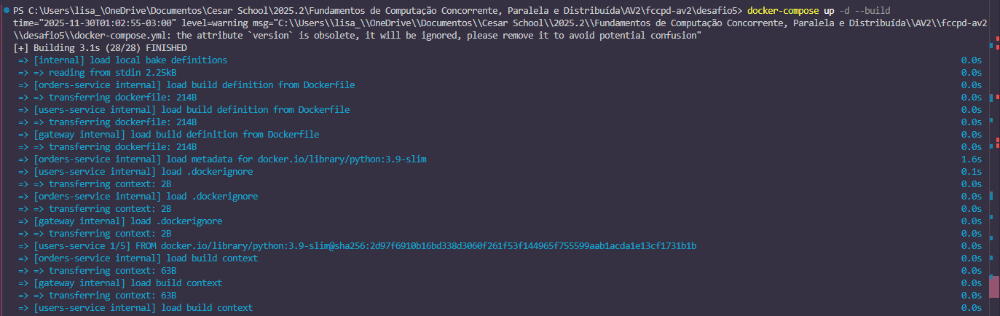


### 3. Verificar se os serviços estão rodando
```bash
docker-compose ps
```
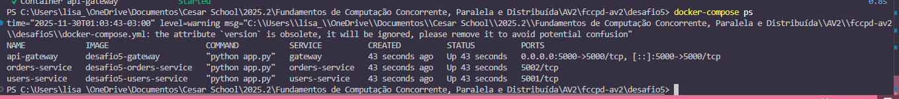

### 4. Testar endpoints do Gateway

⚠️ **Nota sobre encoding:** No Windows PowerShell, caracteres acentuados aparecem como Unicode (`\u00e1` = á, `\u00f3` = ó). Isso é normal e não afeta o funcionamento.

**Teste 1: Informações do Gateway**
```powershell
curl http://localhost:5000/
```
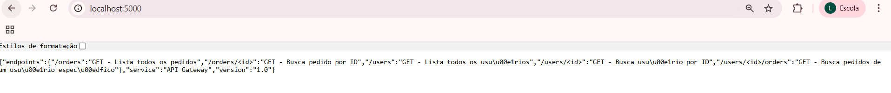
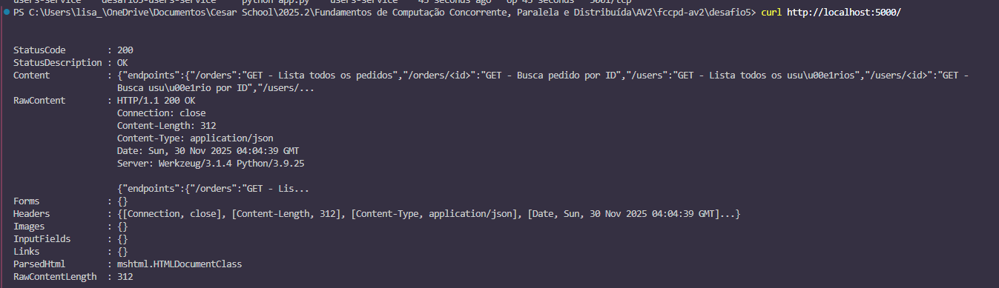

**Saída no Linux:**
```json
{
  "service": "API Gateway",
  "version": "1.0",
  "endpoints": {
    "/users": "GET - Lista todos os usuários",
    "/users/<id>": "GET - Busca usuário por ID",
    "/orders": "GET - Lista todos os pedidos",
    "/orders/<id>": "GET - Busca pedido por ID",
    "/users/<id>/orders": "GET - Busca pedidos de um usuário específico"
  }
}
```

**Saída no Windows PowerShell:**
```
StatusCode        : 200
Content           : {"endpoints":{"/orders":"GET - Lista todos os pedidos","/orders/<id>":"GET - Busca pedido por ID",
                    "/users":"GET - Lista todos os usuários","/users/<id>":"GET - Busca usuário por ID",...}
```

---

**Teste 2: Listar todos os usuários**
```powershell
curl http://localhost:5000/users
```
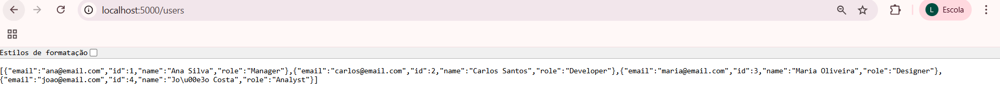
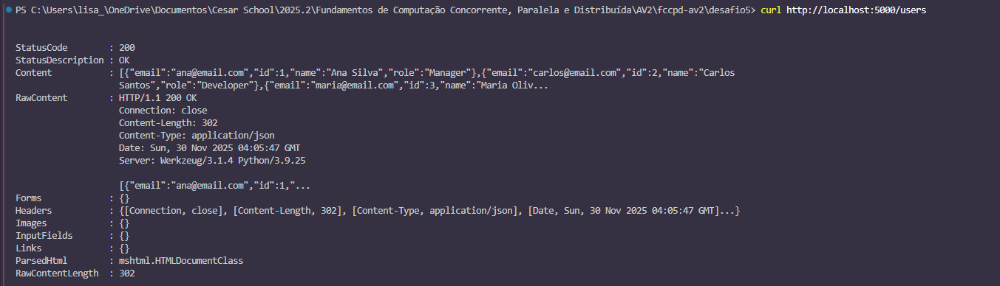

**Saída no Linux:**
```json
[
  {"id": 1, "name": "Ana Silva", "email": "ana@email.com", "role": "Manager"},
  {"id": 2, "name": "Carlos Santos", "email": "carlos@email.com", "role": "Developer"},
  {"id": 3, "name": "Maria Oliveira", "email": "maria@email.com", "role": "Designer"},
  {"id": 4, "name": "João Costa", "email": "joao@email.com", "role": "Analyst"}
]
```

**Saída no Windows PowerShell:**
```
StatusCode        : 200
Content           : [{"email":"ana@email.com","id":1,"name":"Ana Silva","role":"Manager"},
                    {"email":"carlos@email.com","id":2,"name":"Carlos Santos","role":"Developer"}...]
```

---

**Teste 3: Listar todos os pedidos**
```powershell
curl http://localhost:5000/orders
```
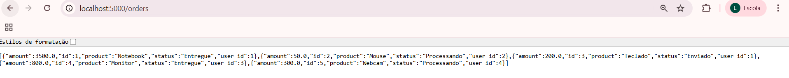
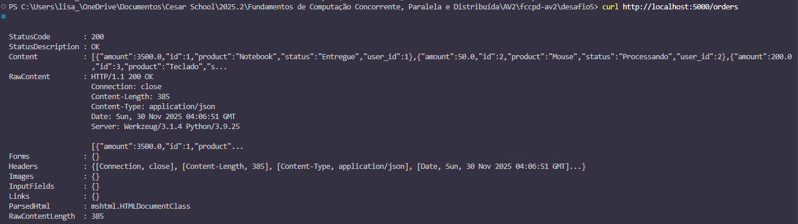

**Saída no Linux:**
```json
[
  {"id": 1, "user_id": 1, "product": "Notebook", "amount": 3500.00, "status": "Entregue"},
  {"id": 2, "user_id": 2, "product": "Mouse", "amount": 50.00, "status": "Processando"},
  {"id": 3, "user_id": 1, "product": "Teclado", "amount": 200.00, "status": "Enviado"},
  {"id": 4, "user_id": 3, "product": "Monitor", "amount": 800.00, "status": "Entregue"},
  {"id": 5, "user_id": 4, "product": "Webcam", "amount": 300.00, "status": "Processando"}
]
```

**Saída no Windows PowerShell:**
```
StatusCode        : 200
Content           : [{"amount":3500.0,"id":1,"product":"Notebook","status":"Entregue","user_id":1},
                    {"amount":50.0,"id":2,"product":"Mouse","status":"Processando","user_id":2}...]
```

---

**Teste 4: Buscar usuário específico**
```powershell
curl http://localhost:5000/users/1
```
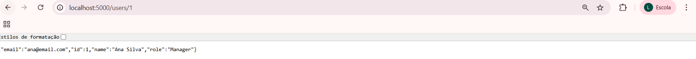
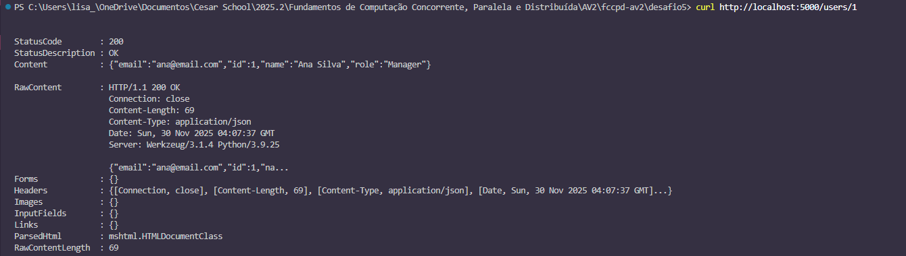

**Saída esperada:**
```json
{"id": 1, "name": "Ana Silva", "email": "ana@email.com", "role": "Manager"}
```

---

**Teste 5: Endpoint combinado - Usuário com seus pedidos**
```powershell
curl http://localhost:5000/users/1/orders
```
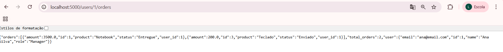
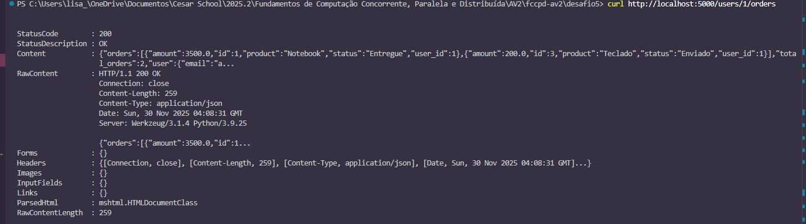

**Saída no Linux:**
```json
{
  "user": {
    "id": 1,
    "name": "Ana Silva",
    "email": "ana@email.com",
    "role": "Manager"
  },
  "total_orders": 2,
  "orders": [
    {"id": 1, "user_id": 1, "product": "Notebook", "amount": 3500.00, "status": "Entregue"},
    {"id": 3, "user_id": 1, "product": "Teclado", "amount": 200.00, "status": "Enviado"}
  ]
}
```

**Saída no Windows PowerShell:**
```
StatusCode        : 200
Content           : {"orders":[{"amount":3500.0,"id":1,"product":"Notebook","status":"Entregue","user_id":1},
                    {"amount":200.0,"id":3,"product":"Teclado","status":"Enviado","user_id":1}],
                    "total_orders":2,"user":{"email":"ana@email.com"...}}
```

💡 **Este endpoint demonstra a orquestração do Gateway:** ele busca dados de dois serviços diferentes e combina em uma única resposta!

---

**Teste 6: Ver JSON formatado no Windows**
```powershell
(curl http://localhost:5000/users/1/orders).Content | ConvertFrom-Json | ConvertTo-Json
```
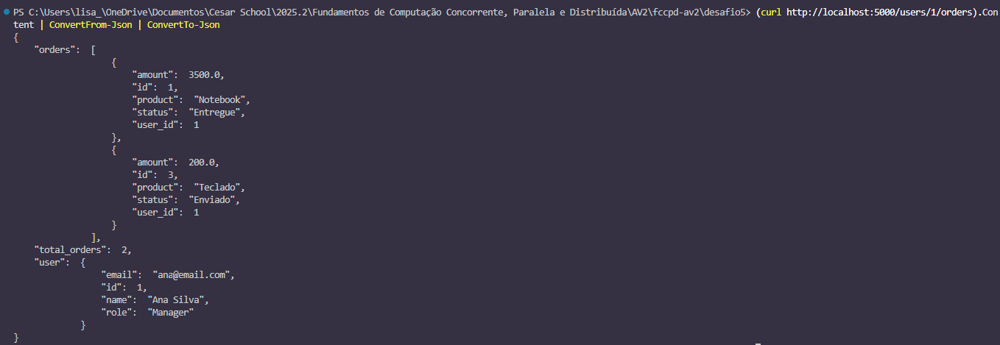

### 5. Demonstrar que Gateway é o único ponto de entrada

**Tentar acessar microsserviços diretamente (deve falhar):**
```bash
# Users Service não é acessível externamente
curl http://localhost:5001/users
# Erro: Connection refused

# Orders Service não é acessível externamente
curl http://localhost:5001/users
# Erro: Connection refused
```
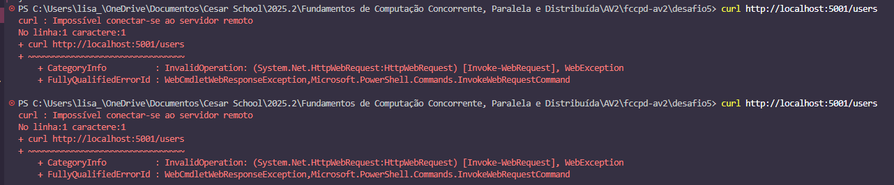

**Isso comprova que:**
- ✅ Microsserviços estão isolados internamente
- ✅ Gateway é o único ponto de entrada
- ✅ Arquitetura segue o padrão API Gateway corretamente

### 6. Testar tratamento de erros

**Simular falha em um microsserviço:**
```bash
# Parar o Users Service
docker stop users-service

# Tentar acessar usuários pelo Gateway
curl http://localhost:5000/users
```
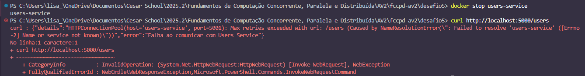

**Saída esperada (erro 503):**
```json
{
  "error": "Falha ao comunicar com Users Service",
  "details": "..."
}
```

**Restartar o serviço:**
```bash
docker start users-service

# Aguardar alguns segundos
sleep 3

# Testar novamente (deve funcionar)
curl http://localhost:5000/users
```
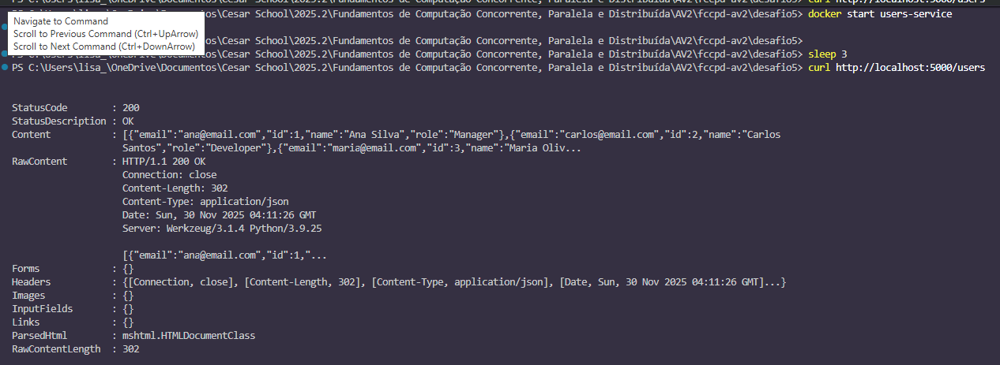

## Parar e Limpar
```bash
# Parar os serviços
docker-compose down

# Ver logs de um serviço específico
docker-compose logs gateway
docker-compose logs users-service
docker-compose logs orders-service

# Reconstruir imagens
docker-compose build

# Subir e reconstruir
docker-compose up -d --build
```

## Scripts de Execução

Este projeto inclui scripts de automação para facilitar a execução em diferentes sistemas operacionais.

### Linux/Mac

**Executar:**
```bash
chmod +x run.sh
./run.sh
```

**Parar e limpar:**
```bash
chmod +x stop.sh
./stop.sh
```

### Windows PowerShell

**Executar:**
```powershell
.\run.ps1
```

**Parar e limpar:**
```powershell
.\stop.ps1
```

⚠️ **Nota:** Se aparecer erro de política de execução no Windows, execute antes:
```powershell
Set-ExecutionPolicy -ExecutionPolicy RemoteSigned -Scope CurrentUser
```

### Execução Manual (alternativa)

Se preferir executar manualmente sem os scripts, siga os passos na seção "Instruções de Execução" acima.

## Endpoints da API

### API Gateway (Porta 5000 - Acesso Externo)

| Método | Endpoint | Descrição | Resposta |
|--------|----------|-----------|----------|
| GET | `/` | Informações do Gateway | JSON com endpoints disponíveis |
| GET | `/users` | Lista todos os usuários | Array JSON (via Users Service) |
| GET | `/users/<id>` | Busca usuário por ID | JSON do usuário (via Users Service) |
| GET | `/orders` | Lista todos os pedidos | Array JSON (via Orders Service) |
| GET | `/orders/<id>` | Busca pedido por ID | JSON do pedido (via Orders Service) |
| GET | `/users/<id>/orders` | Usuário + seus pedidos | JSON combinado (orquestra ambos serviços) |

### Users Service (Porta 5001 - Apenas Interno)

| Método | Endpoint | Descrição | Acesso |
|--------|----------|-----------|--------|
| GET | `/` | Informações do serviço | Interno apenas |
| GET | `/users` | Lista usuários | Via Gateway |
| GET | `/users/<id>` | Busca por ID | Via Gateway |

### Orders Service (Porta 5002 - Apenas Interno)

| Método | Endpoint | Descrição | Acesso |
|--------|----------|-----------|--------|
| GET | `/` | Informações do serviço | Interno apenas |
| GET | `/orders` | Lista pedidos | Via Gateway |
| GET | `/orders/<id>` | Busca por ID | Via Gateway |
| GET | `/orders/user/<user_id>` | Pedidos de um usuário | Via Gateway |

## Variáveis de Ambiente

**API Gateway:**
- `USERS_SERVICE_URL`: URL do Users Service (padrão: `http://users-service:5001`)
- `ORDERS_SERVICE_URL`: URL do Orders Service (padrão: `http://orders-service:5002`)

## Resultado Esperado

### Ao acessar Gateway `GET /`:

**Linux:**
```json
{
  "service": "API Gateway",
  "version": "1.0",
  "endpoints": {...}
}
```

**Windows:**
```
StatusCode: 200
Content: {"service":"API Gateway","version":"1.0","endpoints":{...}}
```

---

### Ao acessar `GET /users`:

**Linux:**
```json
[
  {"id": 1, "name": "Ana Silva", "email": "ana@email.com", "role": "Manager"},
  ...
]
```

**Windows:**
```
StatusCode: 200
Content: [{"email":"ana@email.com","id":1,"name":"Ana Silva","role":"Manager"}...]
```

---

### Ao acessar `GET /users/1/orders` (Endpoint Combinado):

**Linux:**
```json
{
  "user": {"id": 1, "name": "Ana Silva", ...},
  "total_orders": 2,
  "orders": [...]
}
```

**Windows:**
```
StatusCode: 200
Content: {"orders":[...],"total_orders":2,"user":{...}}
```

---

### Ao tentar acessar microsserviços diretamente:
```bash
curl http://localhost:5001/users
# Erro: Connection refused (porta não exposta)
```

## Estrutura do Projeto
```
desafio5/
├── gateway/
│   ├── Dockerfile
│   ├── app.py
│   └── requirements.txt
├── users-service/
│   ├── Dockerfile
│   ├── app.py
│   └── requirements.txt
├── orders-service/
│   ├── Dockerfile
│   ├── app.py
│   └── requirements.txt
├── docker-compose.yml
├── run.sh
├── run.ps1
├── stop.sh
├── stop.ps1
└── README.md
```

## Vantagens do Padrão API Gateway

1. **Ponto único de entrada**: Simplifica o consumo dos microsserviços pelo cliente
2. **Roteamento centralizado**: Gateway direciona requisições para os serviços apropriados
3. **Agregação de dados**: Gateway pode combinar dados de múltiplos serviços (como em `/users/<id>/orders`)
4. **Isolamento**: Microsserviços não são expostos diretamente ao mundo externo
5. **Tratamento de erros**: Gateway lida com falhas de comunicação de forma centralizada
6. **Facilita mudanças**: URLs internas dos serviços podem mudar sem impactar clientes
7. **Segurança**: Camada adicional de controle de acesso

## Troubleshooting

**Problema:** Erro "Falha ao comunicar com Users/Orders Service"
- **Causa:** Microsserviço pode estar indisponível
- **Solução:** Verifique se todos os serviços estão rodando:
```bash
  docker-compose ps
  docker-compose logs users-service
  docker-compose logs orders-service
```

**Problema:** Gateway não inicia (erro de dependência)
- **Causa:** Microsserviços não iniciaram antes do Gateway
- **Solução:** O `depends_on` garante ordem, mas pode demorar. Aguarde alguns segundos após `docker-compose up`

**Problema:** Porta 5000 já está em uso
- **Causa:** Outro serviço (como Desafio 3) está usando a porta
- **Solução:** Pare outros serviços:
```bash
  cd ../desafio3
  docker-compose down
  cd ../desafio5
  docker-compose up -d
```

**Problema:** Microsserviços acessíveis externamente
- **Causa:** Portas foram expostas incorretamente no docker-compose.yml
- **Solução:** Verifique que apenas o Gateway tem `ports:` mapeado no docker-compose.yml

**Problema:** Caracteres com encoding estranho no Windows (`\u00e1`)
- **Causa:** PowerShell exibe Unicode para caracteres acentuados
- **Solução:** Isso é normal! Para ver formatado:
```powershell
  (curl http://localhost:5000/users).Content | ConvertFrom-Json | ConvertTo-Json
```

## Diferenças entre Linux e Windows

| Aspecto | Linux | Windows PowerShell |
|---------|-------|-------------------|
| **Comando curl** | `curl` nativo | `curl` = alias para `Invoke-WebRequest` |
| **Saída** | JSON direto | Objeto com StatusCode, Content, etc |
| **Acentuação** | Texto normal | Unicode (`\u00e1`, `\u00f3`) |
| **Formatação** | Linha única | Multi-linha com detalhes |

**Para ver JSON formatado no Windows:**
```powershell
(curl http://localhost:5000/users).Content | ConvertFrom-Json | ConvertTo-Json
```